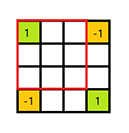
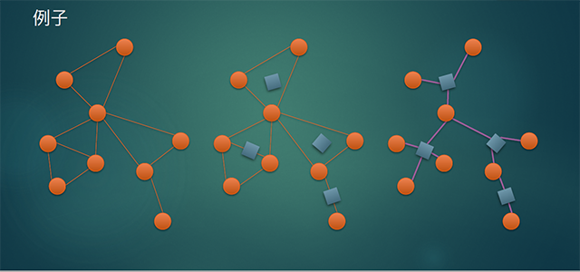

# Virgil's NOIP 提高组模拟赛

## Day1 题解

本套题目主要考察的是选手的代码组织能力和对信息学技巧的应用能力，思维难度较低，但是对代码能力要求较高。

## 1. Pixel Paint (paint.cpp)

> 在棋盘上染色，每次可以染一个长方形或一条斜线，问最后的每个格子染色次数状态。
>
> $n,m\leq1000,k\leq10^4$

### 算法壹

暴力记录每次染色的结果。

时间复杂度 $O(n^2m)$ , 可以获得 $60$ 分。

### 算法贰

对于每个 $0$ 操作，暴力染色；

对于每个 $1$ 操作，二维差分。

二维差分的具体做法就是每次操作时，将四角按照如图所示的方法打标记，最后求二维前缀和即可。

总的时间复杂度为 $O(nm)$ , 可以获得满分。

##2. Angel Player (angel.cpp) 

> 定义一种字符串串匹配，每个字符是由大写字母和正整数组成的二元组，两个串能匹配，当且仅当两个串相应位置的大写字母相同，且对应位置的正整数字符在本串中的排名相等。
>
> 给定模式串 $P$ 和文本串 $T$ , 求出所有匹配的位置。
>
> $n,m\leq10^6$

### 算法零

输出样例法，时间复杂度 $O(1)$，可以获得 $5$ 分。

### 算法壹

暴力匹配，时间复杂度 $O(n^2log_2n)$ ，可以获得 $40$ 分。

### 算法贰

KMP 匹配字符，时间复杂度 $O(n)$ ，但只能解决每个动作串中力度单调的情况，可以获得 $70$ 分。

### 算法叄

特殊匹配条件的 KMP+树状数组

考虑：序列满足条件可以由每个数**前面比它小的数的个数**判定。

于是我们可以先预处理出每个数前面比它小的数应该有多少个。

所以需要先求出next数组。

考虑 KMP 求 next 数组的过程：当满足条件时从前一个递推到后一个。那么可以使用树状数组维护比一个数小的数的个数，当当前小于该数的数的个数不等于应有的个数时就减少长度，并暴力将减掉的数从树状数组中删除。

由于每次 next 减少对应的是前面的 next 的增加，而 next 每次只增加1，因此对于每个字符的均摊时间复杂度是 $O(log_2m)$ 的。

然后求出 next 数组后就是匹配的过程，和求 next 类似，需要离散化。

总的时间复杂度为 $O((n+m)log_2m)$

可以获得 $85$ 分

### 算法叄 EXT

在算法叄的基础上，使用包括不限于位运算、缓存优化等常数优化技巧。

时间复杂度 $$\displaystyle O\left(\frac{(n+m)log_2m}{wys}\right)$$ . 其中 $wys$ 为王逸松常数。

可能获得满分。

### 算法肆

正解算法的描述可能十分冗长，但保证了严谨性。不要被长篇的证明欺骗，您完全可以略读这些证明，此算法并未超出 NOIP 选手的平均能力范围。当然，在考场上，算法叄已经足够优秀，算法肆就当做送给数学爱好者的礼物，相信在读完这一部分后，您一定会体会到 OI 之美的。

在大部分模式串匹配问题中，模式串与母串在位置 $j$ 匹配当且仅当 $P=T[j\dots j+n-1]$ 。这个问题给出了一种不同的串匹配定义，模式串与母串匹配，当且仅当 $P$ 与 $T[j\dots j+n-1]$ 是同构的。我们称呼两个长度为 $k$ 的串同构，当且仅当 $a[i] < a[j] \Leftrightarrow b[i] < b[j] , \forall 1 \leq i, j \leq k$ 。

为简化符号，我们把 $a$ 与 $b$ 同构写成 $a\sim b$ 。下面，我们有两个简单但是重要的结论。给定三个长为 $k$ 的序列 $a,b,c$.

1. 如果 $a\sim b$，则 $a[l\dots r] \sim b[l\dots r],1\leq l \leq r \leq k$.
2. 如果 $a \sim b$ 且 $b \sim c$ ，则 $a \sim c$.

为了解决这个问题，我们拓展了 KMP 算法来满足需求。接下来，我们假定读者熟悉 KMP 算法。

#### 计算 fail 指针

我们定义：一个序列 $a[1\dots k]$ 的边界为其一个长为 $t$ 且与 $a[1\dots t]$ 相似的后缀。在 KMP 算法中，我们一开始要计算失败指针 f 。对于每个 $1 \leq i \leq n$，我们想知道串 $P[1\dots i]$ 除自己本身外的最长边界是什么：
$$
f[i] = \max\limits_{k=1}^i p[1..k] \sim p[i - k + 1\dots i]
$$
另外，我们令 $f[0]$ 设为 $0$.

我们以 $i$ 递增的顺序来计算 $f[i]$. $P[1\dots i]$ 的最长边界包括 $P[1\dots i - 1]$ 的一部分和字母 $P[i]$ . 我们遍历 $P[1\dots i - 1]$ 的所有边界，从最长的开始，对于每个边界，我们检查添加一个字母 $P[i]$ 后能否构成 $P[1\dots i]$ 的一个边界。

我们用下面的引理来遍历所有边界，它的证明稍后给出。

**引理1**

> $P[1\dots i]$ 的所有边界的长度依次为 $f[i], f[f[i]], f[f[f[i]]], f[f[f[f[i]]]]\dots$

注意：由于 $0 \leq f[i] < i$ , 上述序列从某些点开始就只出现 $0$ 了。

现在仍然遗留一个问题：如何判断 $P[1\dots i - 1]$ 的一个边界加上一个字母 $P[i]$ 后可以构成 $P[1\dots i]$ 的一个边界。换句话说，给定两个串 $a[1\dots k],b[1\dots k]$（前者是模式串的一个前缀，后者是模式串的一个子串），已知 $a[1\dots k - 1] \sim b[1\dots k - 1]$，如何判断 $a[1\dots k] \sim b[1\dots k]$ . 注意到这就是判断下式是否成立：

$$
a[q] < a[k] \Leftrightarrow  b[q] < b[k], \forall 1 \leq q < k
$$
这可以按照下面这个方式重新表述（注意每个序列a、b的元素都是不同的）：

**性质1**：对于一些 $1\leq r \leq k$ , $a[k]$ 是 $a[1\dots k]$ 中第 $r$ 大的元素，$b[k]$ 是 $b[1\dots k]$ 中第 $r$ 大的元素。

我们现在描述一个检查是否满足上述条件的方法。

设 $a[u]$ 是 $a[1\dots k - 1]$ 中比 $a[k]$ 小的元素中最大的一个，$a[w]$ 是 $a[1\dots k - 1]$ 中比 $a[k]$ 大的元素中最小的一个。我们假定这些元素存在，其他情况类似。根据定义，$a[u] < a[k] < a[w]$ . 我们可以知道判断 $b[u] < b[k] < b[w]$ 是否成立是与判断**性质 1** 等价的。这是因为 $a[1\dots k - 1] \sim b[1\dots k - 1]$ , 所以 $a[1..k - 1]$ 中比 $a[u]$ 小的数的个数等于 $b[1\dots k - 1]$ 中比 $b[u]$ 小的数的个数。类似地，$a[1..k - 1]$ 中比 $a[w]$ 大的数的个数等于 $b[1..k - 1]$ 中比 $b[w]$ 大的数的个数。所以，这个检测与**性质 1 **实质上是等价的。

现在，我们讨论如何计算 $u$ 和 $w$ 的下标。对于每个 $1 \leq i \leq n$ , 我们需要在 $P[1\dots i]$ 找到比 $P[i]$ 小的最大元素，把这个下标记作 $g[i]$ . 我们也需要知道比 $P[i]$ 大的最小元素，记作 $h[i]$ .（这是一个对称的问题）

注意到 $P[1\dots n]$ 是一个长度为 $n$ 的排列。我们维护一个由 $P[1\dots i]$ 的所有元素构成的递增的双向链表。初始时他只是一个 $1\dots n$ 的所有元素构成的链表。每一步都要删除一个元素。我们记录链表中的每个元素在 $P[1\dots n]$ 中的位置，也记录 $P[1\dots n]$ 的每个元素在链表中的位置。链表使得我们对于每个 $i$ ，可以在常数时间内获得与 $p[i]$ 最接近的元素——他们只是链表中，删除了 $n - i$ 个元素之后，$P[i]$ 的前驱与后继。

这就给出了一个计算 fail 指针的算法。$O(n)$ 预处理出数组 $g[i\dots n]$ 与它的对称问题 $h[i\dots n]$ 之后，算法就与 KMP 算法的失败指针的计算完全一致了。整个算法的运行时间为 $O(n)$ .

#### 寻找匹配

变形的 KMP 匹配算法的主要过程大概如下：

给定模式串的一部分，尽量拓展一个字符。如果不可行，用失败指针得到一个稍短的部分匹配，继续匹配文字。

这也是我们在这个问题中要做的事。用上面的方法，我们能够在常数时间内判断一个部分匹配能不能再拓展一个字符。正确性的证明很简单，主要思想是：如果我们跳过一些正确的匹配（即，我们用失败指针把部分匹配移动得太多超过了匹配的开始），我们马上就得到这与失败指针的定义是矛盾的。

最后，由于匹配过程只是 KMP 算法的轻微修改，所以在 $O(n+m)$ 的时间内可以出解。所以，整个算法只需要线性时间。

#### 附

**引理1**的证明：

> 我们证明，如果 $p[1\dots i]$ 有一个长度为 $t$ 的边界，那么比 $t$ 短的最长的边界长度为 $f[t]$ . 如果 $f[t] = 0$ ，那么长度为 $t$ 的边界是最短的一个。从边界的定义可以知道， $p[1..t] \sim p[i - t + 1..i]$ .
>
> 我们首先证明 $P[1\dots i]$ 有一个长度为 $f[t]$ 的边界。首先，注意到 $P[1\dots t] \sim  P[i - t + 1\dots i]$ . 由此得出，对于每个 $1 \leq s < t$ , $P[1\dots t]$ 有一个长度为s的边界。此外，任意一个 $P[1\dots t]$ 的边界与 $P[i - t + 1\dots i]$ 的边界相似。所以，一个长度为 $f[t]$ 的 $P[1\dots t]$ 的边界与长为 $f[t]$ 的 $P[i - t + 1\dots i]$ 的边界相似。这就表明 $P[1\dots f[t]] \sim P[i - f[t] + 1\dots i]$ .
>
> 为了完成这个证明，我们得证明没有长度严格在 $f[t]$ 与  $t$ 之间的边界存在。为了证明这个，我们证明每一个这样长度的边界一定也是 $P[1\dots t]$ 的边界，否则会和 $f[t]$ 的定义相矛盾。设 $f[t] < u < t$ 且 $P[1\dots u] \sim P[i - u + 1\dots i]$ , 也就是说， $P[1\dots i]$ 有一个长度为 $u$ 的边界。这意味着 $P[1\dots t]$ 的一个长度为 $u$ 的后缀与 $P[1..t + 1..t]$ 的一个长度为u的后缀相似。我们已经知道 $P[1..t]$ 和 $P[i - t + 1..i]$ 相似，所以 $P[i - t + 1..i]$ 的一个长为 $u$ 的后缀与 $P[1..i]$ 的一个长为 $u$ 的后缀相似。所以 $P[1\dots t]$的一个长为 $u$ 的后缀与 $P[1\dots u]$ 相似，矛盾。

## 3. Harmonics (harmonics.cpp)

> 一个带点权无向图，每次询问某一点到另一点的所有 **路径中经过的点权的最小值** 的最小值，点权会有修改。
>
> $n,m,q\leq10^5,w_i\leq10^9$

### 算法壹

模拟法，获得 $8$ 分

### 算法贰

当 $m=n-1$ 时，原图退化为一棵树，树上两点间的路径是唯一确定的。

直接暴力修改，时间复杂度 $O(nq)$ , 可以通过 $3\sim5$ 测试点，共 $12$ 分。

### 算法叄

树上倍增求最小值，时间复杂度 $O(qlog_2n)$ , 可代通过 $3\sim 9$ 获得 $28$ 分。

### 算法肆

树链剖分后用线段树维护区间点权最小值，时间复杂度 $O(qlog_2^2n)$ , 可通过 $3\sim14$ 测试点，获得 $48$ 分。

### 算法伍

用 tarjan 算法缩点双，生成一棵树，然后在割点处特殊处理。再加上树链剖分，时间复杂度 $O(qlog_2^2n)$ ，可以获得满分。

### 算法陆

算法伍虽然能解决这道题目，但是代码复杂度过高，而且不具备普适性，需要大量时间想特判，稍有不注意就打出 gg。

因此，我们可以用一种新的方法——**圆方树**来解决这类问题。

先科普一下 OI 历史：

圆方树最常见的用途本是解决仙人掌（一条边最多属于一个环的特殊无向图）相关问题，然而仙人掌问题近些年来因为细节过于复杂，代码量过大（$10kb$ 是很常见的），所以已经逐渐退出 OI 界。但这并不代表着圆方树也凉凉了，圆方树可以用于求解一般图问题。

> 提问：仙人掌不是比一般图更加特殊吗，为什么一般图上的问题反而简单了？
>
> 由于仙人掌的优良性质，树上的算法经过繁多的特判之后就可以搬到仙人掌上了，导致仙人掌题普遍细节多、码量大，逐渐成为了令国家集训队选手都十分头疼毒瘤题。
>
> 然而一般图就不一样了，因为一般图是一般的，所以可以出的问题都不是很复杂（相对来说），所以比较适合 OI 竞赛。

在 WC2018 中，仙人掌业界毒瘤 immortalCO (锟yeye) 为大家介绍了圆方树在解决一般图上问题的应用，鉴于他曾说过：圆方树是一个 NOIP 难度的东西，笔者为了进一步科普圆方树，就把它出到了 NOIP 模拟赛中。

 ~~不要骂笔者毒瘤，你们要知道之前笔者之前考过的一套 NOIP 模拟赛里出过仙人掌最短路，不知道比这难道哪里去了！~~

好了，现在开始讲圆方树。

顾名思义，圆方树就是由圆点和方点组成的树，把一张无向图建成圆方树需要如下步骤：

- 初始时，原图中的每个点都是圆点
- 对于每个点双连通分量：
  - 删去内部所有边
  - 建立一个方点，并向点双中的所有点连边

按照朴素的想法，可以把方点权值设为点双中最小的权值，但这样每次修改就会造成 $O(n)$ 个方点权值的变化。

为解决这一问题，我们可以定义方点的权值为该点双中的非根节点的点权最小值，这样修改圆点权值只需再修改父亲方点的权值即可。

这样的做法唯一需要特判的是如果询问两点的 LCA 是方点，还需要考虑其父亲。

这样，总的时间复杂度 $O(qlog_2^2n)$ ，可以获得满分。

最后，~~强烈推荐《Angel Beats》~~希望大家喜欢这套题目。